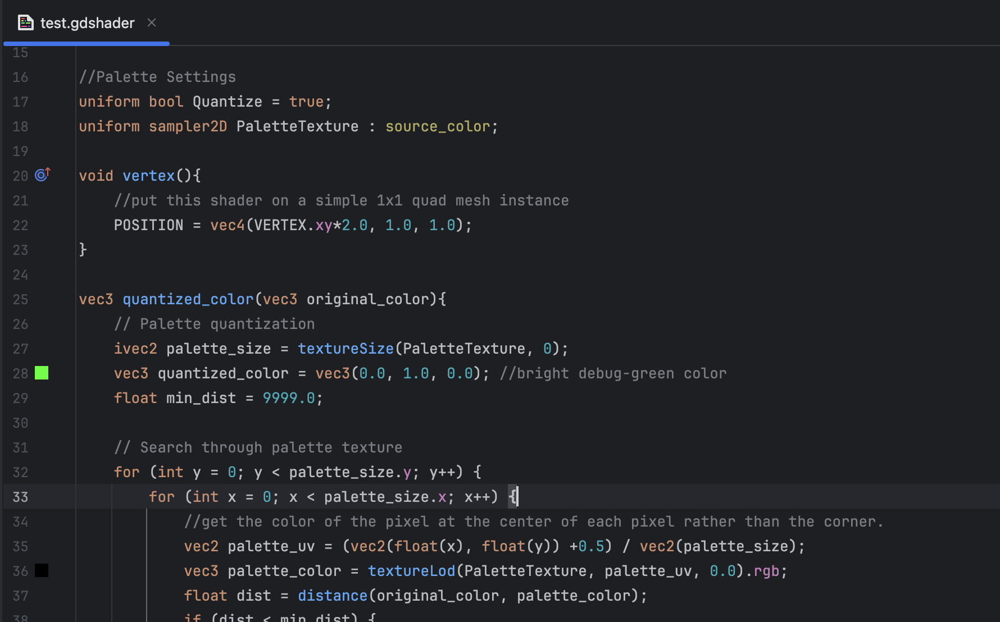

# JetBrains plugin for GDShader 🤖

---

<iframe width="384px" height="319px" src="https://plugins.jetbrains.com/embeddable/card/27949"></iframe>

---

## ✨ Features

- 🎨 Syntax highlighting for GDShader (`.gdshader`) files
- 🔍 Indexing of GDShader files for file search
- 📄 Creation of new GDShader files from templates
- 💡 Code completion for keywords, standard functions, and custom variables
- 🧹 Code formatting support
- 🔧 Rename refactoring support
- 🌈 Color preview and picker

## 💻 Supported IDEs

- Rider
- IntelliJ IDEA
- Other JetBrains IDEs

## 📥 Installation

- Via Marketplace ([Link](https://plugins.jetbrains.com/plugin/27949-gdshader)):
  - Open your JetBrains IDE.
  - Go to `Preferences` > `Plugins`.
  - Search for "GDShader" in the Marketplace tab.
  - Click `Install`.
- Manual Installation:
  - Download the latest release `.zip` file from the [Releases page](https://github.com/akghxhs55/gdshader-support/releases).
  - Open JetBrains IDE.
  - Go to `Preferences` > `Plugins` > `Gear (⚙️) icon` > `Install Plugin from Disk…`.
  - Select the downloaded `.zip` file and click `OK`.

## 📜 License

This plugin is licensed under the **MIT License**.

## 🤝 Contributing

Contributions, bug reports, and suggestions are welcome!
Feel free to open issues or pull requests on this repository.
