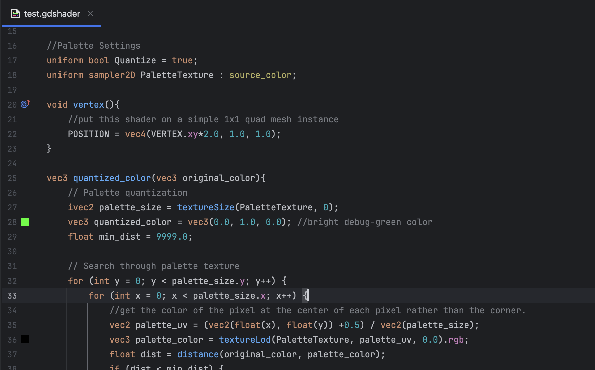

# JetBrains plugin for GDShader 🤖

---

This plugin adds GDShader (Godot Shading Language) support for JetBrains IDEs.

---

## ✨ Features

- 🎨 Syntax highlighting
- 💡 Code completion for keywords, built-in functions, and user-defined symbols
- 🧹 Code formatting with configurable style
- 🔍 Find Usages and Go to Definition
- 🔧 Rename refactoring
- 📋 Parameter info and parameter name hints
- 🏗️ Structure view
- 🔲 Surround with (if, for, while, do-while)
- 📂 Code folding
- 🌈 Color preview and picker
- 📖 Documentation for built-in functions and uniforms
- 📄 File templates for shader types

## 💻 Supported IDEs

- Rider
- IntelliJ IDEA
- Other JetBrains IDEs

## 📥 Installation

- Via Marketplace ([Link](https://plugins.jetbrains.com/plugin/27949-gdshader)):
  - Open your JetBrains IDE.
  - Go to `Preferences` > `Plugins`.
  - Search for "GDShader" in the Marketplace tab.
  - Click `Install`.
- Manual Installation:
  - Download the latest release `.zip` file from the [Releases page](https://github.com/akghxhs55/gdshader-support/releases).
  - Open JetBrains IDE.
  - Go to `Preferences` > `Plugins` > `Gear (⚙️) icon` > `Install Plugin from Disk…`.
  - Select the downloaded `.zip` file and click `OK`.

## 📜 License

This plugin is licensed under the **MIT License**.

## 🤝 Contributing

Contributions, bug reports, and suggestions are welcome!
Feel free to open issues or pull requests on this repository.
